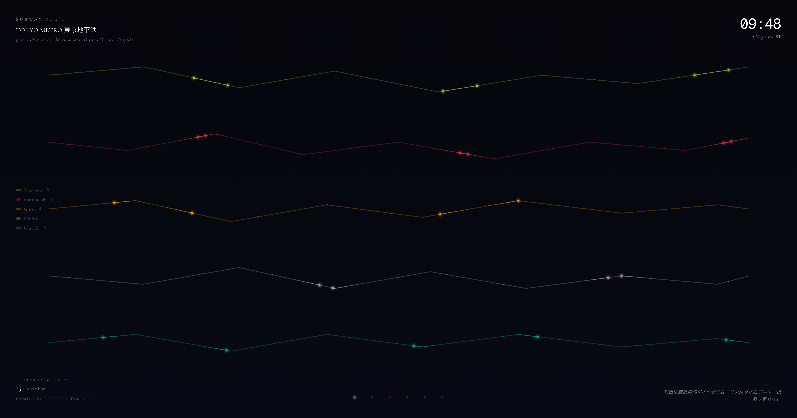
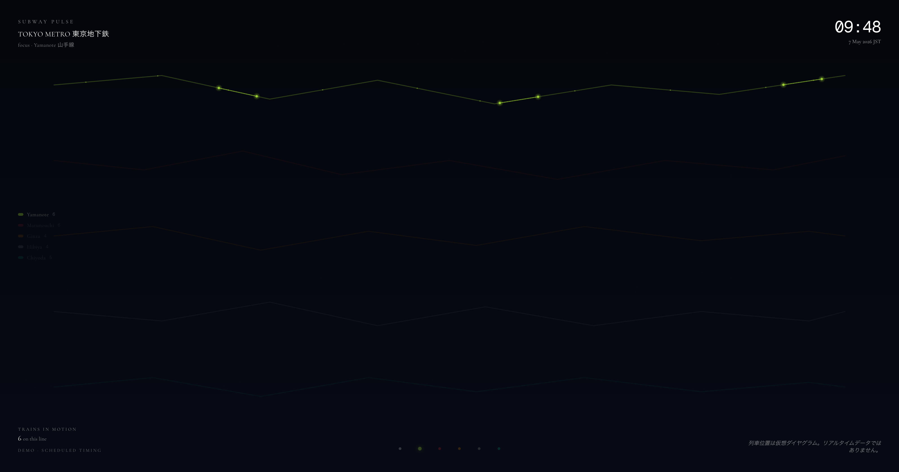
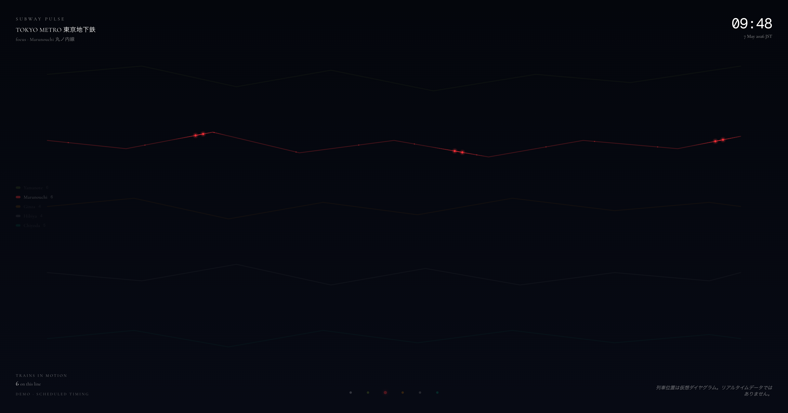

# Subway Pulse

Tokyo's subway lines, drawn as five colored arcs across a black canvas, with trains flowing along them in mock-scheduled pulses. Sister piece to [Tide Pixels](https://github.com/Jada-Q/tide-pixels), [Sky Traffic](https://github.com/Jada-Q/sky-traffic), and [Bay Ships](https://github.com/Jada-Q/bay-ships) — same minimal editorial layer, same single-canvas RAF loop, different live signal.

<p align="center">
  
  
  
</p>

<p align="center"><em>Five lines together (Yamanote · Marunouchi · Ginza · Hibiya · Chiyoda) · Yamanote focus mode · Marunouchi focus mode. Each dot is a train moving along its line; the trail behind it is its path over the last ~30 seconds.</em></p>

**Live**: [subway-pulse-2026-05-07.vercel.app](https://subway-pulse-2026-05-07.vercel.app)

Open it in a browser tab, or set it as a Mac desktop wallpaper via [Plash](https://sindresorhus.com/plash) and watch the lines pulse all day.

---

## Honest data label

This is **not live ODPT data**. Real-time Tokyo public-transport feeds (Open Data Platform for Public Transportation) require a manual-approval API token that's a 1–3 day pipeline; this project deliberately ships without it.

What you see is a **demo schedule**: each line has a hand-tuned headway (Yamanote ~150 s, Marunouchi ~180 s, Ginza ~210 s, Hibiya ~210 s, Chiyoda ~240 s — roughly real intervals), trains spawn at those rates, and each train walks a hand-drawn polyline end-to-end in 12–18 minutes. Direction alternates so each line carries traffic both ways.

The UI labels itself `DEMO · SCHEDULED TIMING` in the bottom-left and `列車位置は仮想ダイヤグラム。リアルタイムデータではありません。` in the bottom-right.

---

## Lines + URLs

| Mode | URL |
|---|---|
| All 5 lines (default) | [`/`](https://subway-pulse-2026-05-07.vercel.app/) |
| Yamanote 山手線 only | [`/?l=yamanote`](https://subway-pulse-2026-05-07.vercel.app/?l=yamanote) |
| Marunouchi 丸ノ内線 only | [`/?l=marunouchi`](https://subway-pulse-2026-05-07.vercel.app/?l=marunouchi) |
| Ginza 銀座線 only | [`/?l=ginza`](https://subway-pulse-2026-05-07.vercel.app/?l=ginza) |
| Hibiya 日比谷線 only | [`/?l=hibiya`](https://subway-pulse-2026-05-07.vercel.app/?l=hibiya) |
| Chiyoda 千代田線 only | [`/?l=chiyoda`](https://subway-pulse-2026-05-07.vercel.app/?l=chiyoda) |

In single-line focus mode, the other four fade to ~5% alpha and act as quiet siblings; the focused line and its trains stay full brightness.

The bottom dot row (right side on mobile) lets you switch between modes live.

---

## What's actually drawn

- **Five polylines**, hand-placed control points giving each line an organic editorial shape (not a real geographic map — Beck-style abstract diagram).
- **Line colors** taken from official Tokyo Metro / JR East branding: Yamanote `#9acd32`, Marunouchi `#f62e36`, Ginza `#ff9500`, Hibiya `#b5b5ac`, Chiyoda `#00bb85`.
- **Stations** as small ticks along each polyline (~8–12 per line).
- **Trains** spawn on each line at its headway interval, walk the polyline forward at end-to-end / wall-time, leave a fading 30 s trail, and despawn at the line end. Direction alternates spawn-to-spawn so the line breathes both ways.
- **Editorial overlay** — title / time JST / line legend with per-line train counts / total trains in motion / demo label / footnote.

---

## Tech stack

- Next.js 16 (App Router, server components for `searchParams`)
- Tailwind v4
- Cormorant Garamond + Geist Mono (`next/font/google`)
- Plain Canvas 2D + `requestAnimationFrame`
- No backend, no database, no network calls — everything is computed client-side from polyline + scheduler state

---

## Local dev

```bash
pnpm install
pnpm dev
```

Open <http://localhost:3000>.

```bash
pnpm build  # production build
```

---

## Used as a desktop wallpaper

1. Install [Plash](https://apps.apple.com/app/plash/id1494023538) (free, Mac App Store).
2. Plash menu bar → `Add Website…` → paste a URL above.
3. Keep `Browsing Mode` off — Subway Pulse has no required interaction; switching modes happens via Plash's website list (add multiple, one per focus mode).

For multi-display: assign different focus modes per monitor — the rhythm contrast across lines makes the screen feel alive.

---

## v2 path: real ODPT data

The ODPT (Open Data Platform for Public Transportation Japan) provides live Tokyo train position data:

- Endpoint pattern: `https://api.odpt.org/api/v4/odpt:Train?acl:consumerKey=$ODPT_TOKEN`
- Returns train objects with `odpt:railway`, `odpt:fromStation`, `odpt:toStation`, etc.

To swap demo for real:
1. Sign up at <https://www.odpt.org/> (manual approval, 1–3 days)
2. Set `ODPT_TOKEN` in Vercel env
3. Add `app/api/trains/route.ts` proxy that fetches ODPT and translates station codes → polyline progress
4. Switch `lib/trains.ts` from `tickMock(now)` to `tickFromOdpt(now, fetched)`

Polyline shapes stay hand-drawn (geographic accuracy isn't the point); only train positions become real.

---

## License

MIT — do whatever you want.
